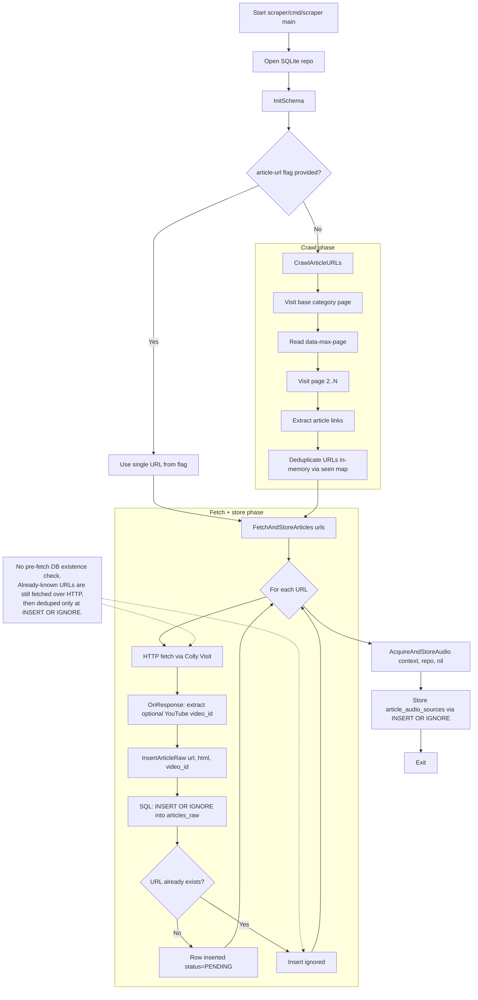

# Architecture

This document summarizes the implemented architecture.

## Canonical source

For normative behavior and architectural rules, use:

- `openspec/specs/project-layout/spec.md`
- `openspec/specs/web-scraper/spec.md`
- `openspec/specs/sqlite-storage/spec.md`
- `openspec/specs/static-data/spec.md`
- `openspec/specs/frontend-portability/spec.md`

## High-level pipeline

```text
scraper -> data/spots.db -> viz/public/data/spots.json -> viz frontend
```

## Current implementation shape

- `scraper/cmd/scraper` crawls category pages, fetches article HTML, stores raw inputs, and reports pending work
- `scraper/cmd/export` reads SQLite and writes frontend JSON
- `viz/` is reserved for frontend work that consumes `/data/spots.json`

## Current scraper processing flow (implemented)



If this summary ever disagrees with `openspec/specs/`, treat the specs as canonical.
